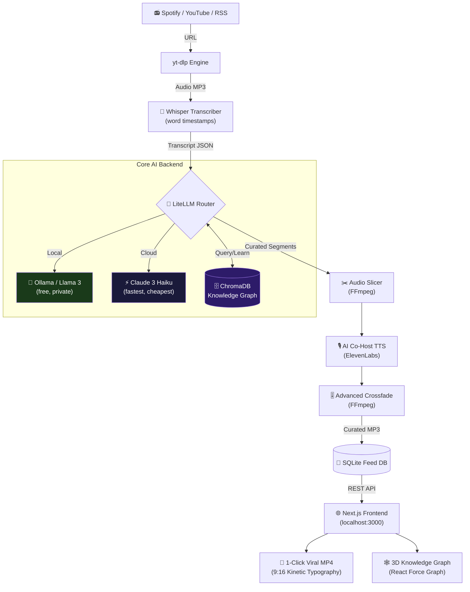

<div align="center">

# 🎙️ AI Podcast Engine 2.0

**The infinite, personalized radio station of pure knowledge.**

*Stop listening to 3-hour podcasts for 10 minutes of value.*

[](https://github.com/yourusername/podcast-engine-2.0/actions/workflows/ci.yml)
[](https://www.python.org)
[](https://fastapi.tiangolo.com)
[](LICENSE)
[](CONTRIBUTING.md)
[](https://ollama.com/)
[](docker-compose.yml)

[**Quick Start**](#-quick-start) · [**Architecture**](#%EF%B8%8F-architecture) · [**Features**](#-features) · [**API Docs**](#-api-reference) · [**Roadmap**](#-roadmap) · [**Contributing**](CONTRIBUTING.md)

---

```
  Podcast (3 hrs) ──► Whisper ──► LLM Filter ──► Knowledge Graph ──► 8-min insight feed
                                                        ↑
                                              "You already know this"
```

</div>

## What is this?

AI Podcast Engine 2.0 is a **radical re-imagining of podcast consumption**. Feed it any YouTube link, RSS feed, or Spotify episode. It uses OpenAI Whisper to transcribe, an LLM (Claude or local Ollama) to extract only the highest-density knowledge segments, cross-references against your personal **Vector Knowledge Graph** to skip content you already know, then stitches it into a smooth, curated audio feed voiced by an **AI Co-Host**.

The result: **an infinite, TikTok-style audio feed of pure knowledge, personalized to what you don't know yet.**

---

## Features

### Core Pipeline
- **Multi-source ingestion** — YouTube, RSS, podcast feeds, direct audio URLs via `yt-dlp`
- **Whisper transcription** — word-level timestamps with local OpenAI Whisper (no API cost)
- **LLM curation** — strips ads, filler, and generic banter; keeps only dense insights
- **Dual LLM support** — use Claude (API) or Ollama/Llama 3 (local, 100% free)
- **Knowledge Graph deduplication** — ChromaDB vector store prevents re-surfacing concepts you already know

### Synthesis & Output
- **AI Co-Host narration** — ElevenLabs TTS generates smooth transitions between clips
- **Advanced FFmpeg stitching** — crossfades between segments for broadcast-quality output
- **1-Click Viral Export** — vertical 9:16 MP4 clips with Hermozi-style kinetic typography (for TikTok/Reels)

### Interaction
- **"Hold Spacebar to Interrupt"** — pause the feed and ask the AI Co-Host anything about the current topic
- **REST API** — full FastAPI backend with Swagger docs at `/docs`
- **Anthropic OAuth** — one-click Claude authentication (no manual token copy-paste)

### Developer Experience
- **Local-first** — run completely offline with Ollama + local Whisper
- **Docker support** — `docker-compose up` and you're running
- **Fully tested** — pytest suite with mocks for all heavy dependencies

---

## Architecture



---

## Quick Start

### Option A: Docker (Recommended — 1 command)

```bash
git clone https://github.com/yourusername/podcast-engine-2.0.git
cd podcast-engine-2.0
cp .env.example .env        # Add your API keys (all optional for local-only mode)
docker-compose up
```

Open [http://localhost:8000/docs](http://localhost:8000/docs) for interactive API docs.

### Option B: Manual Setup

**Prerequisites:** Python 3.10+, FFmpeg, Node.js 18+

```bash
git clone https://github.com/yourusername/podcast-engine-2.0.git
cd podcast-engine-2.0

# One-command setup
make install

# Configure (optional — local mode works with zero API keys)
cp .env.example .env

# Run the stack
make dev
```

Or step by step:

```bash
# Backend
cd backend
python -m venv venv && source venv/bin/activate
pip install -r requirements.txt
uvicorn main:app --reload --port 8000

# Frontend (new terminal)
cd frontend
npm install && npm run dev
```

---

## Configuration

Copy `.env.example` to `.env`:

```bash
cp .env.example .env
```

| Variable | Required | Description |
|---|---|---|
| `ANTHROPIC_API_KEY` | Optional | Claude API key. Leave blank to use local Ollama |
| `ELEVENLABS_API_KEY` | Optional | For AI Co-Host voice. Falls back to silent transitions |
| `SPOTIPY_CLIENT_ID` | Optional | Spotify integration for episode lookup |
| `SPOTIPY_CLIENT_SECRET` | Optional | Spotify integration |
| `OLLAMA_BASE_URL` | Optional | Defaults to `http://localhost:11434` |
| `WHISPER_MODEL` | Optional | `tiny`, `base`, `small`, `medium`, `large`. Defaults to `base` |
| `KNOWLEDGE_GRAPH_THRESHOLD` | Optional | Similarity threshold (0.0–1.0). Defaults to `0.8` |

> **Zero API keys needed for local mode.** Set `USE_LOCAL_LLM=true` to use Ollama + local Whisper.

### Anthropic OAuth (alternative to API key)

```bash
# Start backend, then open browser to:
curl http://localhost:8000/auth/anthropic/start
# Browser opens → click Authorize → done. Token saved automatically.
```

---

## API Reference

Full interactive docs available at [http://localhost:8000/docs](http://localhost:8000/docs).

| Endpoint | Method | Description |
|---|---|---|
| `GET /` | GET | Health check |
| `POST /api/process` | POST | Submit a podcast URL for processing |
| `GET /api/feed` | GET | Get the curated knowledge feed |
| `GET /api/config` | GET | Check which API keys are configured |
| `POST /api/config` | POST | Update API keys at runtime |
| `POST /api/chat/interrupt` | POST | Ask the AI Co-Host a question |
| `GET /auth/anthropic/start` | GET | Start Anthropic OAuth flow |
| `GET /media/*` | GET | Serve generated audio files |

**Example: Submit a podcast**

```bash
curl -X POST http://localhost:8000/api/process \
  -H "Content-Type: application/json" \
  -d '{"url": "https://www.youtube.com/watch?v=dQw4w9WgXcQ"}'
```

**Example: Get your feed**

```bash
curl http://localhost:8000/api/feed | jq '.feed[].title'
```

---

## Tech Stack

| Layer | Technology |
|---|---|
| **Backend** | FastAPI, Uvicorn, SQLite, Python 3.10+ |
| **Transcription** | OpenAI Whisper (local, no API cost) |
| **LLM** | LiteLLM router → Claude 3 Haiku or Ollama/Llama 3 |
| **Vector DB** | ChromaDB (persistent local knowledge graph) |
| **Media** | FFmpeg (stitching + crossfades), yt-dlp (download), MoviePy (video export) |
| **TTS** | ElevenLabs (AI Co-Host) or local fallback |
| **Frontend** | Next.js 14, Tailwind CSS v4, Framer Motion, React Force Graph 3D |
| **Container** | Docker + docker-compose |

---

## How the Knowledge Graph Works

The Knowledge Graph is the core innovation that prevents you from re-learning the same thing.

```
Episode 1: Naval on leverage
 └─► Extract concepts → embed → store in ChromaDB

Episode 2: Tim Ferriss on leverage
 └─► Extract concepts → embed → query ChromaDB
     └─► "Leverage" distance: 0.12 (already known → SKIP)
     └─► "Permissionless leverage via code" distance: 0.91 (new → KEEP)
```

Every insight added to your feed also updates your knowledge graph, so the system gets smarter over time.

---

## Development

```bash
# Run tests
make test

# Lint and format
make lint

# Build Docker image
make docker-build

# Full CI check
make ci
```

### Project Structure

```
podcast-engine-2.0/
├── backend/
│   ├── main.py                    # FastAPI entry point
│   ├── requirements.txt
│   ├── app/
│   │   ├── ai/
│   │   │   └── llm_router.py      # LiteLLM router (Claude / Ollama)
│   │   ├── api/
│   │   │   ├── auth.py            # Anthropic OAuth
│   │   │   ├── config.py          # Runtime config endpoint
│   │   │   └── voice_chat.py      # "Hold to Interrupt" endpoint
│   │   ├── core/
│   │   │   └── knowledge_graph.py # ChromaDB vector knowledge store
│   │   ├── db/
│   │   │   └── database.py        # SQLite feed database
│   │   ├── services/
│   │   │   ├── download.py        # yt-dlp audio downloader
│   │   │   ├── pipeline.py        # Main orchestration pipeline
│   │   │   └── transcribe.py      # Whisper transcription
│   │   ├── synthesis/
│   │   │   ├── advanced_media.py  # FFmpeg crossfade stitching
│   │   │   └── cohost.py          # ElevenLabs AI Co-Host TTS
│   │   └── viral/
│   │       └── exporter.py        # MoviePy vertical video generator
│   └── tests/
│       ├── conftest.py
│       ├── test_api.py
│       ├── test_database.py
│       └── test_media.py
├── frontend/                      # Next.js 14 UI
├── docker-compose.yml
├── Dockerfile
├── Makefile
├── .env.example
└── README.md
```

---

## Roadmap

See [CONTRIBUTING.md](CONTRIBUTING.md) for the full v3 roadmap. Key upcoming features:

- [ ] **Real-time streaming** — WebSocket-based live feed updates
- [ ] **3D Knowledge Graph UI** — React Force Graph 3D visualization of your learned concepts
- [ ] **Multi-speaker diarization** — identify and filter by specific guests
- [ ] **Spotify integration** — ingest from your saved shows automatically
- [ ] **Newsletter export** — weekly digest of top insights as HTML email
- [ ] **Podcast recommendations** — find new shows based on your knowledge graph
- [ ] **Video podcast support** — visual frame extraction for YouTube clips
- [ ] **Multi-user support** — separate knowledge graphs per user
- [ ] **Mobile app** — React Native feed player

---

## Contributing

Contributions, issues, and feature requests are welcome. Read [CONTRIBUTING.md](CONTRIBUTING.md) to get started.

Short version:
1. Fork & clone
2. `make install`
3. Create your feature branch: `git checkout -b feat/your-feature`
4. Make changes, add tests
5. `make ci` to verify everything passes
6. Open a PR

---

## License

[MIT](LICENSE) — built for the community.

---

<div align="center">

**If this project saves you even one hour of listening to podcast fluff, please star it ⭐**

Made with obsession by developers who had too many unfinished podcast queues.

</div>
