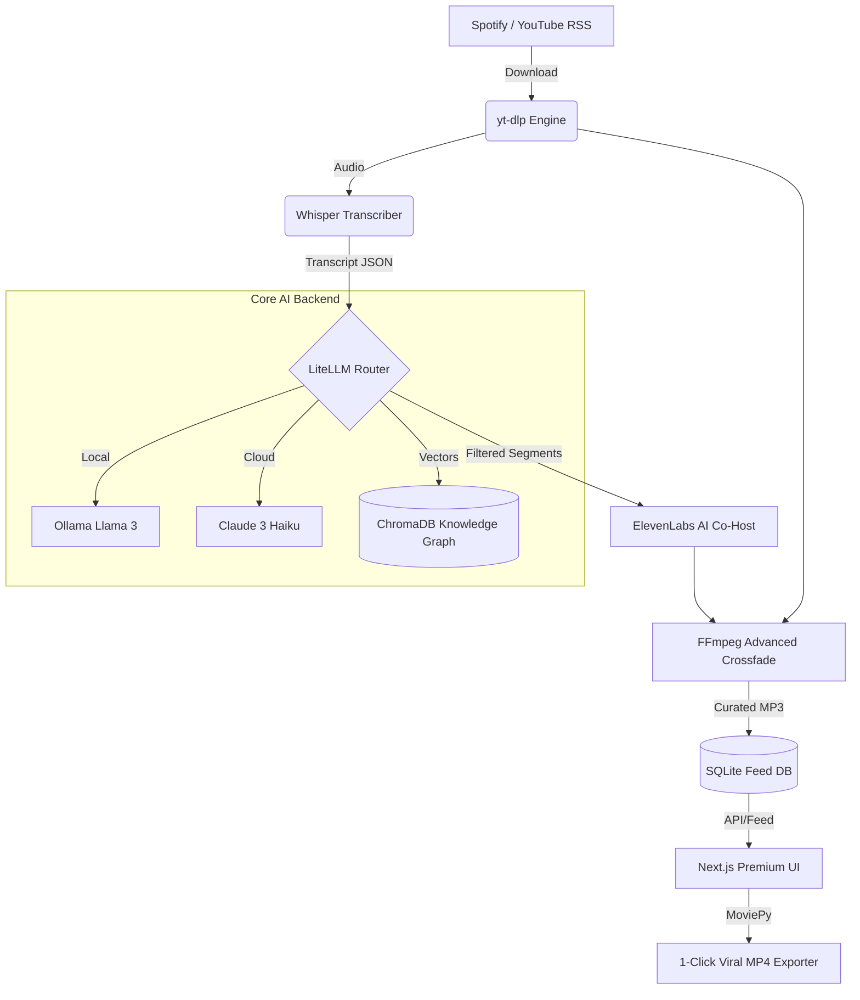

<div align="center">
  
</div>

<h1 align="center">🎙️ AI Podcast Engine 2.0</h1>
<p align="center">
  <em>The infinite, personalized radio station of pure knowledge. Built for developers.</em>
</p>

<p align="center">
  <a href="https://github.com/yourusername/podcast-engine-2.0/stargazers"></a>
  <a href="https://github.com/yourusername/podcast-engine-2.0/blob/main/LICENSE"></a>
  <a href="https://ollama.com/"></a>
</p>

---

## 🔥 What is this?
AI Podcast Engine 2.0 is a radical re-imagining of how we consume long-form audio. Instead of listening to 3 hours of a podcast for 10 minutes of value, this engine ingests hundreds of episodes, uses LLMs to strip the fluff, cross-references against your personal **Vector Knowledge Graph** to avoid repeating things you know, and drops the resulting high-density insights into an infinite, TikTok-style audio feed.

Oh, and there's an **AI Co-Host** driving the transitions. 

## ✨ Viral Features
*   🧠 **The Neural Lexicon:** A visually stunning 3D WebGL interface mapped to the concepts you've consumed.
*   🎙️ **1-Click Viral Export:** Automatically generate vertical (9:16) MP4 snippets with Hermozi-style kinetic typography.
*   🚦 **Local-First (No API Keys required):** Fully integrated with **Ollama** and local Whisper for 100% free, private execution.
*   🗣️ **"Hold to Interrupt":** Pause the feed to interrogate the AI Co-Host on the specific paper or topic the guest just mentioned.

---

## 🏗️ Architecture

The system is split into an asynchronous Python Backend and a jaw-dropping Next.js Glassmorphic Frontend.



## 🚀 Quick Setup (3 Minutes)

We've provided a frictionless setup script. 

### 1. Clone & Install
```bash
git clone https://github.com/yourusername/podcast-engine-2.0.git
cd podcast-engine-2.0
./install.sh
```

### 2. Configure (Optional)
Copy `.env.example` to `.env`. If you want to use local models, just leave the Cloud keys blank. The `LiteLLM` router defaults to Ollama.

### 3. Run the Stack
```bash
# Terminal 1: Start the AI Backend
cd backend && uvicorn main:app --reload

# Terminal 2: Start the Next.js UI
cd frontend && npm run dev
```

Visit `http://localhost:3000` to enter the stream.

## 🛠️ Stack
*   **Frontend:** Next.js 14, Tailwind V4, Framer Motion, React Force Graph 3D
*   **Backend:** FastAPI, Uvicorn, SQLite, LiteLLM
*   **Media Processing:** FFmpeg, yt-dlp, MoviePy
*   **AI Models:** CTranslate2 (Whisper), Ollama / Claude (Inference), ElevenLabs (TTS), ChromaDB.

## 🤝 Contributing
Issues and PRs are heavily welcomed! Check the `CONTRIBUTING.md` to see the roadmap for v3 (Video Podcast parsing).
